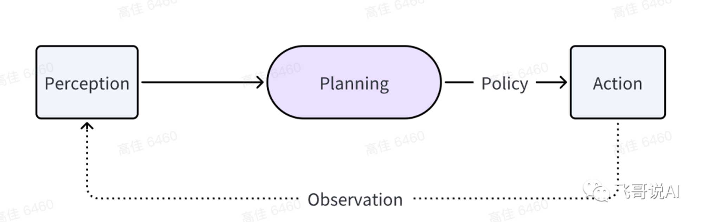
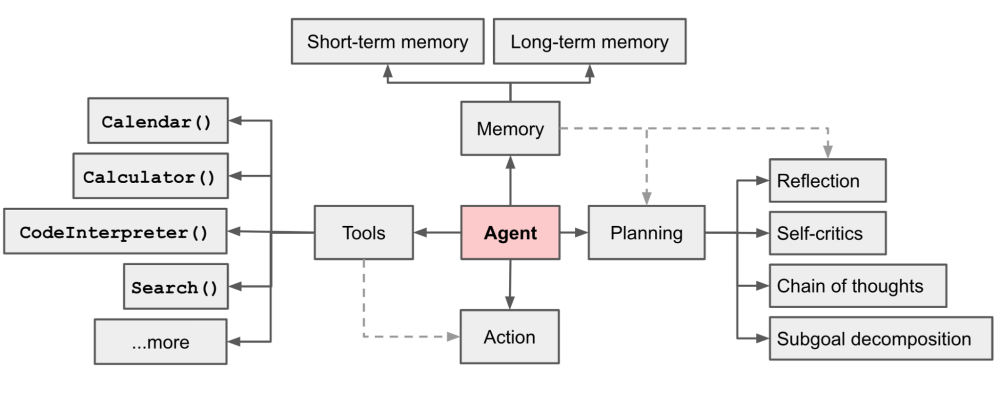
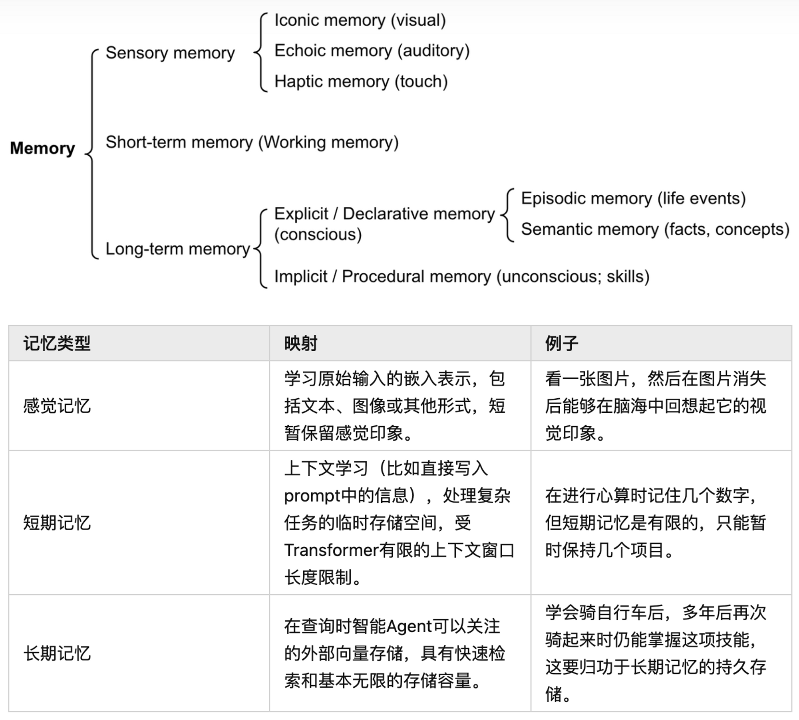
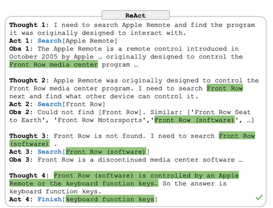

# [NOTE](https://www.breezedeus.com/article/ai-agent-part1 )
## 1. Introduction
Agent 强调自主性和主动性，智能体是以智能方式行事的代理，Agent感知环境，自主采取行动，
以实现目标，并可以通过学习或获取知识来提高其性能。
Agent决策流程：

感知（Perception）是指Agent从环境中收集信息并从中提取相关知识的能力。
规划（Planning）是指Agent为了某一目标而做出的决策过程。
(产生Policy)
行动（Action）是指基于环境和规划做出的动作。
（通过观察（Observation）成为进一步Perception、的前提和基础）

## 2. 如何决策
决策的很重要的信息来源是记忆（Memory)

- 最早的记忆截断是感觉记忆（Sensory Memory），提供在原始刺激结束后保留感官信息的印象的能力，通常只持续几秒钟。对应于学习原始输入（包括文本、图像或其他模式）的嵌入表示。
- 短期记忆（Short-term Memory）它储存我们当前意识到的信息，已执行复杂的认知任务，如学习和推理。对应于上下文，短暂且有限。
- 长期记忆（Long-term Memory）是指我们能够存储大量信息的能力，这些信息可以在需要时检索出来。视为外部向量库。
    - 显性/陈述记忆（Explicit/declarative memory）是对事实和事件的记忆，指的是那些可以被有意识地回忆的记忆，包括
  情景记忆（事件和经验）和语义记忆（事实和概念）。
    - 隐性/程序记忆（Implicit/procedural memory）这种记忆是无意识的，涉及自动执行的技能和例行程序，如骑自行车或在键盘上打字。

## 3. Prompts
### 3.1 Cot
### 3.2 React
Reasoning and Acting，由少量任务解决轨迹组成，包含人工编写的文本推理轨迹和操作，以及针对操作的环境观察结果。

think、action、observation
- react + cot
- cot + react