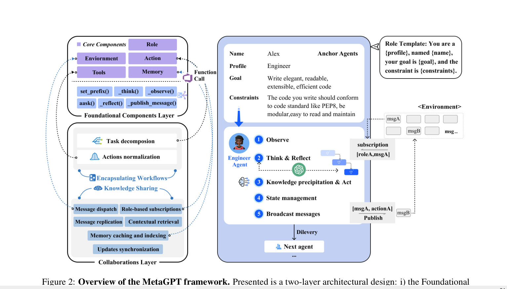

- 引入sop,集成了人类工作流程，以实现更可控和验证的性能。
- workflow

- 角色定义，为角色添加了约束（领域知识要求）角色、名称、目标、约束
- 智能体不仅可以接受和相应信息，还可以观察环境以提取关键细节。这些观察知道其思考和后续行动。最后，从
环境中提取了重要信息，并存储在记忆中以备将来参考有效地使每个代理成为主动学习者。 （summarize？？）
- 思考和反思，角色可以检索角色描述来构架思考，然后反思需要做什么以及决定下一步行动，通过_think()函数，先思考，再行动--谨慎考虑后再回复
- 观察，角色可以观察环境，并基于观察进行思考/行动，使用_observe()函数，他们关注重要信息，并将其纳入记忆以丰富对上下文的理解并指导未来决策。
- 广播消息。角色可以使用_publish_messages()函数将消息广播到环境中。这些消息包含当前执行结果和相关操作记录的详细信息，用于发布和共享信息。
- 